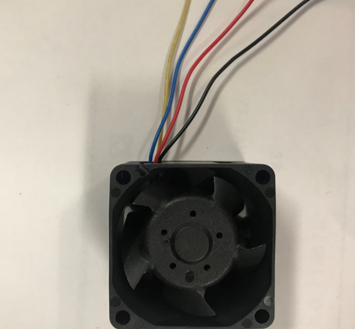
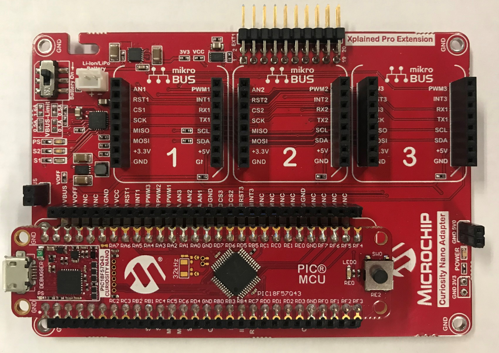
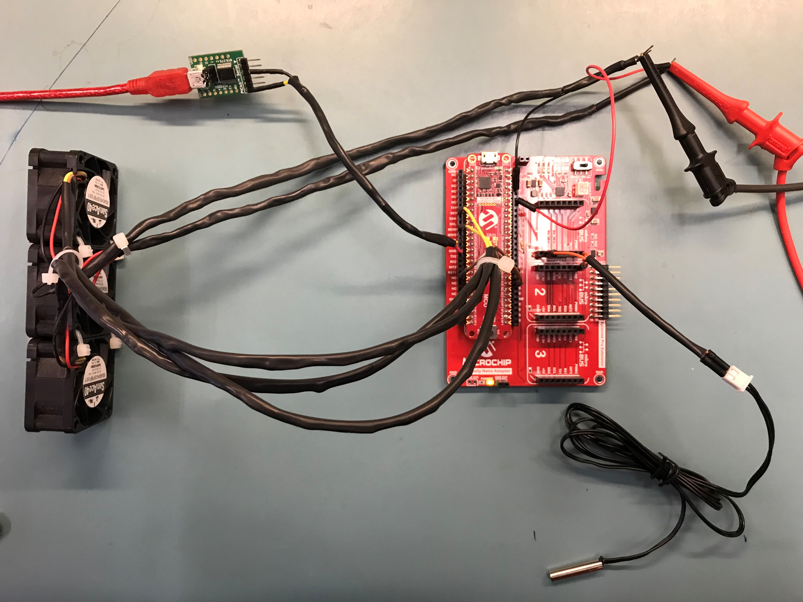
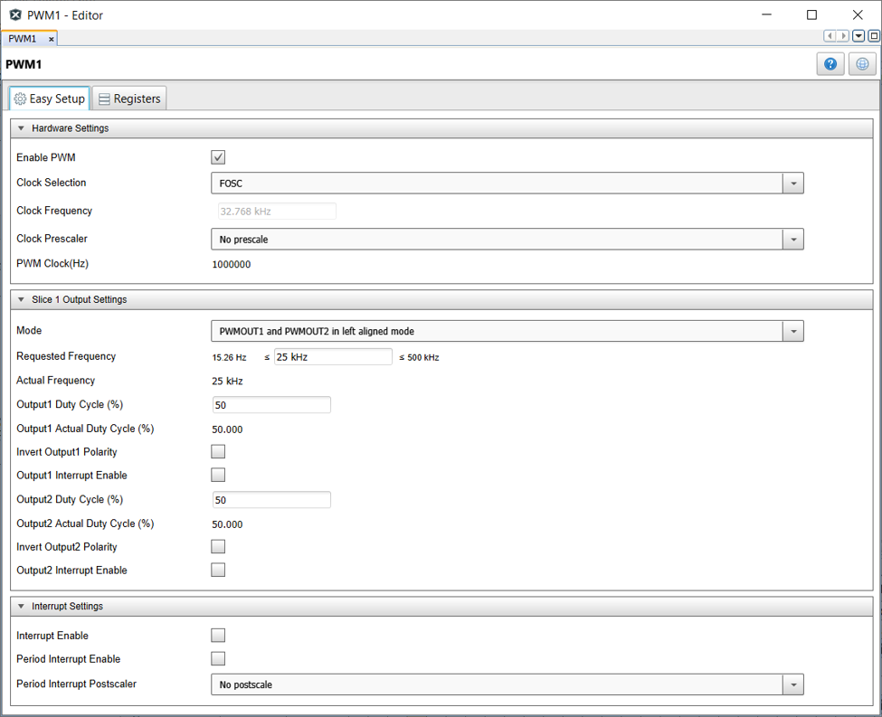
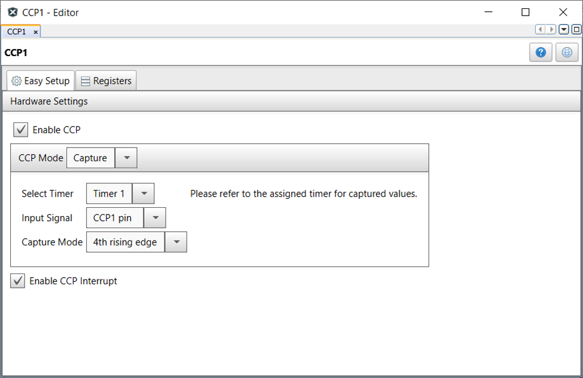
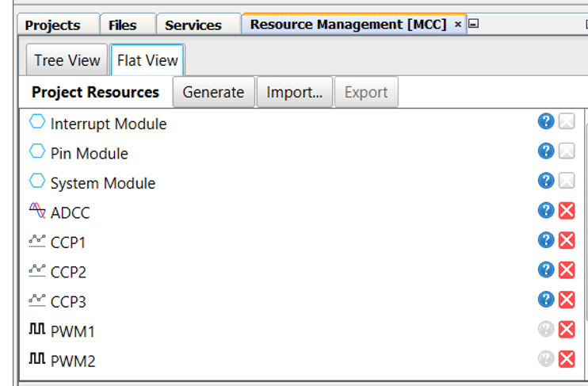

# Objective:
The “pic18f57q43_curiosity_nano_pwm_fan_control” project highlights the use of the PIC18-Q43 family’s new 16-bit PWM module to control three Brushless DC (BLDC) fans. The onboard 12-bit Analog-to-Digital Converter with Computation (ADCC) is used to measure a temperature sensor, whose temperature is used to determine the proper fan speeds. To ensure the fans are operating at the correct speed, the Capture/Compare/PWM (CCP) module captures each fan’s tachometer signal. Software computes and compares the actual fan speeds read by the CCP and adjusts the PWM output to correct any speed variations. Finally, fan speed and temperature information are transmitted to a PC terminal program using the Universal Asynchronous Receiver Transmitter (UART) module.

# Demo Configuration:
The Curiosity Nano Development Board (DM164150) is used in conjunction with the Curiosity Nano Base for Click Boards (AC164162) as the development platform. The Nano Base board has three MikroElektronika Click board slots, several types of power connections, voltage regulation circuitry, and a header mount for the Nano Development board. For this project the Nano Base board was used as a circuit interface, connecting each of the three fans’ PWM and tachometer signals, as well as the temperature sensor and UART signals, to the microcontroller via header pins.
Each of the three fans used in this project has four wires:
- A 5V DV positive power (Red wire)
- GND (Black wire)
- PWM input (Yellow wire)
- Tachometer output (Blue wire)

### Four Wire Fan:


The positive and ground wires are all tied together and connected to a 5V DC power supply, while each individual fan’s tachometer and PWM wire must be connected to microcontroller I/O pins. For testing and verification purposes, an oscilloscope may be connected to the tachometer and PWM wires.

The fan signals, temperature sensor, UART, and microcontroller pin connections are as follows:

|Signal        | Micrcontroller Pin |
|------------- | :----------------: |
|Fan 1 PWM     | RC0                |
|Fan 1 Tach    | RC3                |
|Fan 2 PWM     | RC1                |
|Fan 2 Tach    | RC4                |
|Fan 3 PWM     | RD1                |
|Fan 3 Tach    | RB5                |
|Temp Sensor   | RA1                |
|UART TX       | RC6                |

### Curiosity Nano Development Board and Nano Base Board:


### Complete Project Setup:


# Project Software Configuration:
The project software was developed in MPLAB X with the help of the MPLAB Code Configurator (MCC) plug-in tool. The MCC tool provides a user-friendly interface that generates software based on the user’s parameters. MCC allows developers who may not be familiar with a new peripheral a way to quickly set up and test a peripheral without having to dive deep into the device datasheet. For this project, the MCC tool was used to generate code for the PWM, CCP, ADCC, and UART modules.

## PWM Configuration:
The PWM module was configured such that the PWM frequency is 25 kHz, which matches the fan’s nominal PWM input frequency. The PWM duty cycle was selected as 50%, which will drive the fans on initial power-up to roughly half of the fan’s total speed. These options, along with PWM mode, clock, and interrupt selections, are easy to configure in the PWM Editor as seen in the figure below.

### MCC PWM Editor Window:


```c
void PWM1_Initialize(void)
{
    PWM1ERS = 0x00;    // PWMERS External Reset Disabled;
    PWM1CLK = 0x02;    // PWMCLK FOSC;
    PWM1LDS = 0x00;    // PWMLDS Autoload disabled;
    PWM1PRL = 0x00;    // 0x0A00 = 25 kHz PWM frequency @ 64 MHz FOSC
    PWM1PRH = 0x0A;
    PWM1CPRE = 0x00;   // PWMCPRE No prescale;
    PWM1PIPOS = 0x00;  // PWMPIPOS No postscale;
    PWM1GIR = 0x00;
    PWM1GIE = 0x00;    // PWMS1P2IE disabled; PWMS1P1IE disabled;
    PWM1S1CFG = 0x00;  // Left aligned mode;
    PWM1S1P1L = 0x00;
    PWM1S1P1H = 0x05;
    PWM1S1P2L = 0x00;
    PWM1S1P2H = 0x05;
    PWM1CON = 0x80;    // PWMEN enabled
}
```

## CCP Configuration:
The CCP module was configured to capture the Timer1 count value every fourth rising edge of the fans’ tachometer signal. This allows the module to measure each fan’s rotational speed, and compare the actual measured speed to the expected speed. MCC’s CCP Editor window is used to select the CCP’s timer source, mode, interrupts, and input pin.

### MCC CCP Editor Window:


```c
void CCP1_Initialize(void)
{
	CCP1CON = 0x85;                   // MODE every rising edge
	CCP1CAP = 0x00;                   // CCP1CTS CCP1 pin;
	CCPR1H = 0x00;
	CCPR1L = 0x00;
	CCPTMRS0bits.C1TSEL = 0x1;        // Selecting Timer 1
    PIR3bits.CCP1IF = 0;              // Clear the CCP1 interrupt flag
    PIE3bits.CCP1IE = 1;              // Enable the CCP1 interrupt
}
```

## ADCC Configuration:
The ADCC is used to measure the temperature sensor’s output voltage. The ADCC is configured in Burst-Average mode, which allows the ADC hardware to sample the analog input a selectable number of times before calculating the input’s average. This helps prevent fan speed fluctuations, which may produce unwanted noise as the fan constantly adjusted its speed based on the temperature. Additionally, once the temperature is calculated, the ADCC compares the temperature value to user-set threshold values. For this project, the threshold values represent temperature sensor failure conditions, such as an open-circuit or short-circuit condition.

### MCC ADCC Editor window:


```c
void ADCC_Initialize(void)
{
    ADLTHL = 0x32;             // Lower threshold set at 50 (0x0032)
    ADLTHH = 0x00;
    ADUTHL = 0xA0;             // Upper threshold set at 4000 (0x0FA0)
    ADUTHH = 0x0F;
    ADSTPTL = 0x00;            // Setpoint set to 0
    ADSTPTH = 0x00;
    ADACCU = 0x00;
    ADRPT = 0x20;              // Set for 32 samples
    ADPCH = 0x00;
    ADCON1 = 0x00;             // DSEN disabled;
    ADCON2 = 0x53;             // CRS 5; Burst_average_mode
    ADCON3 = 0x57;             // CALC Filtered value vs setpoint
    ADSTAT = 0x00;
    ADREF = 0x00;              // NREF VSS; PREF VDD;
    ADACT = 0x05;
    ADCLK = 0x3F;              // CS FOSC/128;
    ADCON0 = 0x84;             // FM right; ON enabled; CS FOSC/ADCLK

    PIR2bits.ADTIF = 0;       // Clear the ADC Threshold INT flag
    PIE2bits.ADTIE = 1;       // Enabling ADCC threshold interrupt

    ADCC_SetADTIInterruptHandler(ADCC_DefaultInterruptHandler);
}
```

## UART Configuration:
The UART is used to transmit the fan speed and temperature data to a PC terminal program, such as Tera Term, for viewing. For this project, MCC was used to configure the UART for transmit only operation at a baud rate of 9600 bits per second. Additionally, the UART editor offers a selection for the use of the ‘printf’ library. The ‘printf’ library allows the user to write a string of characters to be transmitted with only one command, rather than loading the UART transmit register several times in user software.

MCC UART Editor Window:


```c
void UART1_Initialize(void)
{
    U1CON0 = 0xA0;   // BRGS high speed; 8-bit mode; TXEN enabled;
    U1CON1 = 0x80;   // ON enabled;
    U1CON2 = 0x00;   // TXPOL not inverted; STP Transmit 1Stop bit;
    U1BRGL = 0xC7;   // 9600 BR @ 64 MHz FOSC
    U1BRGH = 0x06;
    U1FIFO = 0x00;
    U1UIR = 0x00;
    U1ERRIR = 0x00;
    U1ERRIE = 0x00;

    UART1_SetFramingErrorHandler(UART1_DefaultFramingErrorHandler);
    UART1_SetOverrunErrorHandler(UART1_DefaultOverrunErrorHandler);
    UART1_SetErrorHandler(UART1_DefaultErrorHandler);

    uart1RxLastError.status = 0;
}
```

## System Configuration:
MCC can be used to configure basic system parameters, such as oscillator selection and I/O pin configuration.
Once all project parameters have been configured, simply press the ‘Generate’ button, and MCC will generate the drivers based on user inputs.

### Generate Button:


# Conclusion:
The ‘pic18f57q43-curiosity-nano-pwm-fan-control’ project uses the PIC18F57Q43 microcontroller’s 16-bit PWM, CCP, ADCC, and UART modules to provide speed control to a set of BLDC fans. The ADCC module reads a temperature sensor whose value is used to determine fan speed via the 16-bit PWM module. The CCP module monitors each fan’s tachometer output to ensure the fans are operating at the correct speed. The UART module transmits fan speed and temperature data to a PC terminal program for viewing.
